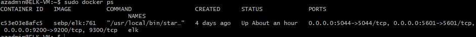

## Automated ELK Stack Deployment

The files in this repository were used to configure the network depicted below.

[Network Diagram](Images/ELK-Stack_Diagram.png)


These files have been tested and used to generate a live ELK deployment on Azure. They can be used to either recreate the entire deployment pictured above. Alternatively, select portions of the playbook file may be used to install only certain pieces of it, such as Filebeat.

  [Ansible Elk Playbook](YAML Files/Install-ELK.yml)

This document contains the following details:
- Description of the Topology
- Access Policies
- ELK Configuration
  - Beats in Use
  - Machines Being Monitored
- How to Use the Ansible Build


### Description of the Topology

The main purpose of this network is to expose a load-balanced and monitored instance of DVWA, the D*mn Vulnerable Web Application.

Load balancing ensures that the application will be highly availiable, in addition to restricting traffic to the network.

Integrating an ELK server allows users to easily monitor the vulnerable VMs for changes to the log files with Filebeat and system metrics and statistics with Metricbeat.

The configuration details of each machine may be found below.

| Name     | Function   | IP Addr. | OS    | Container |
|----------|------------|----------|-------|-----------|
| Jump Box | Gateway    | 10.0.0.4 | Linux | Ansible   |
| Web-1    | Web Server | 10.0.0.5 | Linux | DVWA      |
| Web-2    | Web Server | 10.0.0.6 | Linux | DVWA      |
| Elk-VM   | Elk Server | 10.1.0.4 | Linux | ELK:761   |

### Access Policies

The machines on the internal network are not exposed to the public Internet. 

Only the Jump Box machine can accept connections from the Internet. Access to this machine is only allowed from the following IP addresses: 12.8.7.232


Machines within the network can only be accessed by the Jump Box VM (10.0.0.4).

A summary of the access policies in place can be found in the table below.

| Name     | Publically Accessible | Allowed Addresses         |
|----------|-----------------------|---------------------------|
| Jump Box | Yes                   | Personal IP via Port 22   |
| Web-1    | No                    | 10.0.0.4 via Port 80      |
| Web-2    | NO                    | 10.0.0.4 via Port 80      |
| Elk-VM   | No                    | 10.0.0.4 via Port 5601    |

### Elk Configuration

Ansible was used to automate configuration of the ELK machine. No configuration was performed manually, which is advantageous because it keeps configurations standardized across multiple machines or networks, and saves time while deploying as the process is automated.

The playbook implements the following tasks:
- Installs Docker
- Installs Python3 Pip 
- Installs Pip Docker Module
- Modifies the systemctl file to allow more memory access for the container
- Enables Docker to start up on boot

The following screenshot displays the result of running `docker ps` after successfully configuring the ELK instance.



### Target Machines & Beats
This ELK server is configured to monitor the following machines:
- 10.0.0.5
- 10.0.0.6

We have installed the following Beats on these machines:
- Filebeat
- Metricbeat

These Beats allow us to collect the following information from each machine:
- Filebeat monitors the specified log files and/or locations, collects events, and forwards them to the ELK server.
- Metricbeat collects metrics from the system and its services.

### Using the Playbook
In order to use the playbook, you will need to have an Ansible control node already configured. Assuming you have such a control node provisioned: 

SSH into the control node and follow the steps below:
- Copy the [Elk Playbook](YAML Files/Install-ELK.yml) file to your ansible container. You can use ```curl https://pastebin.com/raw/Vtf8SfJ8 > /etc/ansible/install-elk.yml``` for convenience
- Update the ```hosts``` file to include the servers to be updated (in this scenario, the ELK host server with its IP address)
- Run the playbook using ```ansible-playbook intstall-elk.yml```, and navigate to your Elk Server's Public IP on Port 5601 to check that the installation worked as expected: ```http://[your.ELK-VM.External.IP]:5601```

From there you can install Metricbeat and/or Filebeat:
- In the Ansible container, copy the [Filebeat Playbook](YAML Files/Filebeat-Playbook.yml) or [Metricbeat Playbook](YAML Files/Metricbeat-Playbook.yml)
- Make sure your ```hosts``` file has the IP(s) of the machine(s) you wish to monitor in the Websevers section.
- Run the playbook using ```ansible-playbook filebeat-playbook.yml``` or ```ansible-playbook metricbeat-playbook.yml```
- Verify that Filebeat is running properly by navigating back to ```http://[your.ELK-VM.External.IP]:5601```, go to Add Log Data, System Logs, and scroll down to Module Status. Click check data and it should return with ```Data sucessfully retrieved from this module```
- Verify Metricbeat is running properly by navigating back to ```http://[your.ELK-VM.External.IP]:5601```, go to Add Metric Data, Docker Metrics, and scroll down to Module Status. Click check data and it should return with ```Data sucessfully retrieved from this module```

